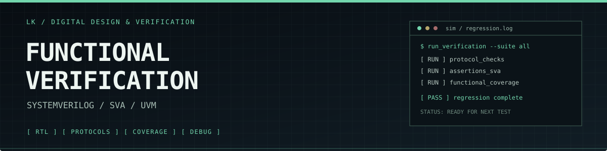

<div align="center">



<br>

<code>ENGINEERING / DIGITAL HARDWARE / VERIFICATION</code>

# Functional Verification Engineer

**SystemVerilog · SVA · UVM · RTL**

ECE graduate focused on functional verification of digital designs: building test environments, checking protocol behavior, and turning design requirements into measurable evidence.

[PORTFOLIO ↗](https://tryhard727.github.io/allfathergivemesite/) &nbsp; / &nbsp; [REPOSITORIES ↗](https://github.com/tryhard727?tab=repositories)

</div>

---

## 01 / PRIMARY DOMAIN

```text
┌─ VERIFICATION STACK ───────────────────────────────────────────────┐
│                                                                    │
│  SYSTEMVERILOG    Testbench architecture, classes, interfaces      │
│  UVM              Agents, sequences, drivers, monitors, scoreboards│
│  SVA              Temporal checks, protocol rules, corner cases    │
│  COVERAGE         Functional coverage, coverage-driven testing     │
│  DEBUG            Simulation, waveform analysis, failure isolation│
│                                                                    │
└────────────────────────────────────────────────────────────────────┘
```

My main focus is **functional verification**—understanding expected design behavior, creating meaningful stimulus, checking responses, and finding corner cases before they become silicon issues.

## 02 / PROJECTS

### `[01]` APB → SPI BRIDGE

**RTL / SystemVerilog / UVM / APB / SPI**

A protocol bridge project combining an APB interface and SPI core with protocol agents and a UVM-based verification environment.

[ VIEW SOURCE ↗ ](https://github.com/tryhard727/spi_uvm_ral)

### `[02]` AXI3 UVM VIP

**SystemVerilog / UVM / AXI3**

A reusable UVM verification environment focused on exercising and checking AXI3 protocol behavior.

[ VIEW SOURCE ↗ ](https://github.com/tryhard727/axi_uvm_vip)

## 03 / TOOLCHAIN

<p align="left">
  
  
  
  
  
  
  
  
</p>

## 04 / INTERESTS

- UVM testbench architecture and reusable verification components
- Assertion-based verification and temporal behavior
- Functional coverage and coverage-driven verification
- RTL design, SoC interfaces, and digital integration

---

<div align="center">

<code>LOCATION: BENGALURU, INDIA</code>

<sub>SPECIFY THE BEHAVIOR. VERIFY THE IMPLEMENTATION.</sub>

</div>
